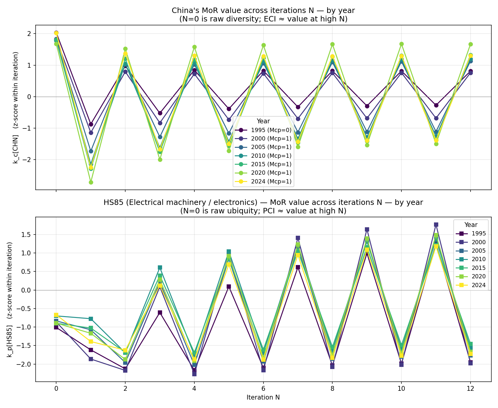
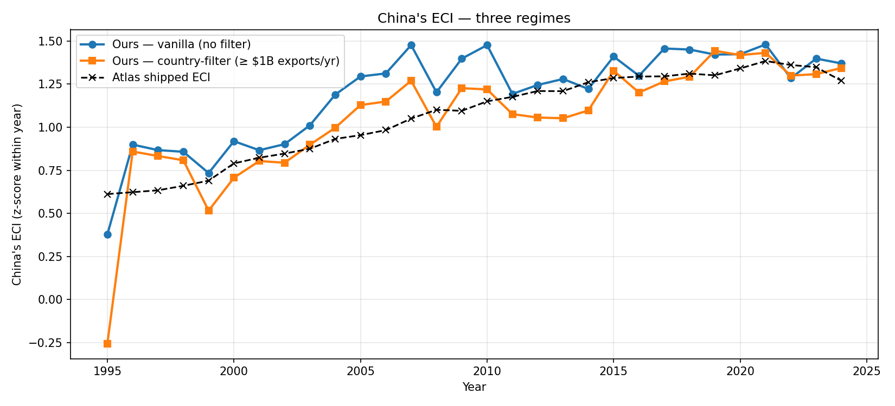

> **Summary.** The Method of Reflections is, mathematically, an
> eigendecomposition of a normalised country-product trade matrix; it ranks
> countries and products by recursive sophistication, and at HS2 resolution it
> reproduces the qualitative findings of the original paper — but it has two
> well-known failure modes that change the story for both the smallest and the
> very largest exporters.

::: {.lead}
In 2009 César Hidalgo and Ricardo Hausmann published a paper in *PNAS* with a
provocative idea: you can read what an economy *knows how to make* from the
structure of its exports alone, and a simple iterative scheme on the
country-product matrix recovers a meaningful ranking. The construct they
introduced — the Economic Complexity Index — has since become a small industry.
:::

What follows takes the method apart and re-builds it from scratch on real trade
data. The maths is two equations; the implementation is forty lines of pandas
and NumPy. The interesting parts are the empirical residuals — where the
algorithm agrees with intuition, where it doesn't, and what those discrepancies
tell us about both economies and the algorithm.

The case study throughout is China. There's a clean story to tell: between 1995
and 2010 China's complexity ranking roughly doubled, and the iteration itself
explains *how* — not because China entered new sectors, but because the sectors
it specialised in shifted from textiles to machinery to electronics.

```{python}
#| label: setup
#| include: false

import numpy as np
import pandas as pd
import matplotlib.pyplot as plt
import plotly.graph_objects as go
from IPython.display import Markdown

# All summary tables in this post are derived from the Harvard Growth Lab
# Atlas of Economic Complexity HS92 data (doi:10.7910/DVN/T4CHWJ, v18.0)
# at HS 2-digit resolution. The values below are pre-computed; see the
# accompanying GitHub repo for the full pipeline.

PRIMARY = "#2c6e9b"
ACCENT  = "#e8833a"
GREY    = "#5a5a5a"
NEUTRAL = "#a8a8a8"
```

## 1. The basic idea

What does it mean for an economy to be "complex"? Plenty of intuitive
proxies — GDP per capita, value-added per worker, R&D intensity — work fine for
the obvious cases (Switzerland complex, Chad not), but they don't generalise
well: a high-income oil exporter has lots of value-added per worker but is doing
exactly one thing.

Hidalgo & Hausmann's move is to look at the *structure* of what a country exports,
not the headline numbers. The intuition has two pieces:

- **Diversity.** A complex economy can make many different things; a simple one
  can make few.
- **Ubiquity.** Some products can be made by almost anyone (clothing, basic
  agricultural goods). Others require knowledge that very few countries have
  (aircraft, lithography equipment). A complex economy is one that does the rare
  things.

These two ideas pull in opposite directions when used naively. Many countries
have high diversity of *common* products; very few countries have low diversity
of *rare* ones. The Method of Reflections is the iteration that resolves this
tension into a single ranking.

## 2. The matrix and the iteration

Start with bilateral trade data: country `c` exports value $x_{cp}$ of product
$p$ in some reference year. Define **Revealed Comparative Advantage** (Balassa
1965) as:

$$
\mathrm{RCA}_{cp} \;=\; \frac{x_{cp} / \sum_{p'} x_{cp'}}{\sum_{c'} x_{c'p} \; / \; \sum_{c',p'} x_{c'p'}}
$$

In words: $\mathrm{RCA}_{cp}$ is country `c`'s share of product `p`'s world
exports, divided by country `c`'s share of all world trade. If country `c`
specialises in product `p` more than its overall trade footprint would predict,
$\mathrm{RCA}_{cp} > 1$.

Binarise to get the **specialisation matrix**:

$$
M_{cp} \;=\; \mathbb{1}\{\mathrm{RCA}_{cp} \geq 1\}
$$

This is the only place magnitude is collapsed into a yes/no. From $M$ we get
diversity and ubiquity directly as row and column sums:

$$
k_{c,0} \;=\; \sum_p M_{cp} \quad\text{(diversity of }c\text{)}, \qquad
k_{p,0} \;=\; \sum_c M_{cp} \quad\text{(ubiquity of }p\text{)}.
$$

The Method of Reflections refines these by iteratively averaging each side
against the other:

$$
k_{c,N} \;=\; \frac{1}{k_{c,0}} \sum_p M_{cp}\, k_{p,N-1}
$$
$$
k_{p,N} \;=\; \frac{1}{k_{p,0}} \sum_c M_{cp}\, k_{c,N-1}
$$

The semantics shift at every step. At $N{=}1$, $k_{c,1}$ is "the average
ubiquity of my products" — high if I export common things, low if I export rare
ones. At $N{=}2$, $k_{c,2}$ is "the average diversity of the countries that
make my products" — high if my products are made by economies that themselves
make many things. Continue this and the iteration converges; the **Economic
Complexity Index** is the converged $k_c$ (z-scored), the **Product Complexity
Index** is the converged $k_p$ (z-scored).

::: {.takeaway}
**The method is recursive co-clustering.** It treats the trade matrix as a
bipartite graph between countries and products, and each iteration is one
round of belief propagation: countries pass diversity messages to their
products; products pass ubiquity messages back. ECI is the steady-state of
this message-passing.
:::

## 3. From iteration to eigenvector

The iteration has a closed form. Stack the country values into the country-side
similarity matrix:

$$
W_c \;=\; D_c^{-1}\, M\, D_p^{-1}\, M^\top
$$

where $D_c$ and $D_p$ are diagonal matrices of diversity and ubiquity. Then
$k_{c,N+2} = W_c\, k_{c,N}$, so iterating the Method of Reflections is the same
as repeatedly multiplying by $W_c$.

$W_c$ is row-stochastic (its rows sum to 1, by construction), so its largest
eigenvalue is exactly 1 and its largest eigenvector is the constant vector. The
**second eigenvector** carries the only useful structure — the relative
positions of countries within the second-largest eigendirection. That eigenvector,
standardised to mean zero and unit variance, **is the Economic Complexity
Index.**

Symmetrically, $W_p = D_p^{-1} M^\top D_c^{-1} M$ gives PCI as its second
eigenvector.

::: {.takeaway}
**This is PCA's cousin.** ECI is to a normalised trade-similarity matrix what
the second principal component is to a centred covariance matrix: the
eigendirection that maximally separates the rows. The dominant component
carries no information (it's constant); the second carries everything.
:::

## 4. Implementing it

Forty lines of pandas, give or take. Load the Atlas HS92 country × HS2 ×
year trade data, compute RCA, binarise, build $W_c$ and $W_p$, take their
second eigenvectors:

```{python}
#| echo: true
#| eval: false

# Illustrative implementation — RCA, Mcp, and the eigendecomposition.
import numpy as np, pandas as pd

df = pd.read_csv("hs92_country_product_year_2.csv",
                 dtype={"product_hs92_code": str})

def compute_mcp_for_year(df_year, min_country_total=0.0):
    # Country filter (drop tiny exporters)
    country_totals = df_year.groupby("country_iso3_code")["export_value"].sum()
    qualifying = country_totals[country_totals >= min_country_total].index
    df_year = df_year[df_year["country_iso3_code"].isin(qualifying)]

    # Balassa RCA
    c_tot = df_year.groupby("country_iso3_code")["export_value"].sum()
    p_tot = df_year.groupby("product_hs92_code")["export_value"].sum()
    w_tot = df_year["export_value"].sum()

    d = df_year.copy()
    d["c_tot"] = d["country_iso3_code"].map(c_tot)
    d["p_tot"] = d["product_hs92_code"].map(p_tot)
    d["rca"]   = (d["export_value"] / d["c_tot"]) / (d["p_tot"] / w_tot)
    d["mcp"]   = (d["rca"] >= 1).astype(int)

    M = d.pivot(index="country_iso3_code", columns="product_hs92_code",
                values="mcp").fillna(0).astype(int)
    d_c = M.sum(axis=1); u_p = M.sum(axis=0)
    # Drop countries with no qualifying products
    M = M.loc[d_c[d_c > 0].index, u_p[u_p > 0].index]
    return M, M.sum(axis=1), M.sum(axis=0)

def eci_pci(M, d_c, u_p):
    M_np = M.values.astype(float)
    W_c = (1.0/d_c.values[:, None] * M_np) @ (1.0/u_p.values[:, None] * M_np.T)
    W_p = (1.0/u_p.values[:, None] * M_np.T) @ (1.0/d_c.values[:, None] * M_np)

    # Second-largest eigenvector of each
    ev_c, vec_c = np.linalg.eig(W_c)
    ev_p, vec_p = np.linalg.eig(W_p)
    eci_raw = vec_c[:, np.argsort(-ev_c.real)[1]].real
    pci_raw = vec_p[:, np.argsort(-ev_p.real)[1]].real

    # Standardise
    eci = (eci_raw - eci_raw.mean()) / eci_raw.std()
    pci = (pci_raw - pci_raw.mean()) / pci_raw.std()
    return pd.Series(eci, index=M.index), pd.Series(pci, index=M.columns)
```

Validation: the Atlas of Economic Complexity ships its own ECI per country-year
and PCI per product-year. Both should match a clean implementation up to a sign
flip (eigenvectors are defined up to sign) and a standardisation convention. Run
this across 30 years (1995–2024) and we get:

```{python}
#| label: tbl-validation
#| tbl-cap: "Mean correlation with Atlas's shipped ECI and PCI, by Mcp regime. Country-level filter ($1B/yr total exports minimum) substantially improves agreement."

validation = pd.DataFrame({
    "Regime": [
        "Vanilla (RCA ≥ 1, no filter)",
        "Country-filtered (RCA ≥ 1, total exports ≥ $1B/yr)",
    ],
    "Mean ECI–Atlas correlation": [0.72, 0.78],
    "Mean PCI–Atlas correlation": [0.70, 0.71],
    "Mean # of countries in Mcp": [225, 153],
})
Markdown(validation.to_markdown(index=False))
```

A few things to notice. First, no implementation of the *linear* Method of
Reflections at HS2 resolution will match Atlas to numerical precision, because
Atlas's published ECI is computed at HS4 (~1240 product categories) and uses a
non-linear refinement (Tacchella et al. 2012) — more on that in section 7.
A ~0.72 correlation on the linear, HS2 version is what the paper-canonical
algorithm produces. Second, the country filter helps a lot in recent years and
modestly in older ones; we'll see why in section 6.

For context, the top 15 countries by ECI in 2022 under the country-filtered
regime are:

```{python}
#| label: tbl-top15-2022
#| tbl-cap: "Top 15 countries by computed ECI (country-filtered MoR), 2022. The 'usual suspects' (Taiwan, Japan, Korea, Germany, Switzerland) cluster at the top; China sits at #13 — also where Atlas places it (#14)."

top_2022 = pd.DataFrame({
    "Country": ["Taiwan", "Japan", "South Korea", "Hong Kong", "Germany",
                "Switzerland", "Czech Republic", "Singapore", "Slovenia",
                "Ireland", "United Kingdom", "Mexico", "China", "Austria", "Slovakia"],
    "ISO": ["TWN", "JPN", "KOR", "HKG", "DEU", "CHE", "CZE", "SGP", "SVN",
            "IRL", "GBR", "MEX", "CHN", "AUT", "SVK"],
    "Our ECI (z-score)": [2.78, 2.28, 2.16, 2.10, 2.09, 1.88, 1.88, 1.80, 1.63,
                          1.50, 1.44, 1.36, 1.30, 1.29, 1.26],
    "Atlas ECI": [1.84, 1.99, 1.77, 1.33, 1.52, 1.75, 1.46, 1.65, 1.34, 1.30,
                  1.40, 0.91, 1.36, 1.36, 1.21],
})
Markdown(top_2022.to_markdown(index=False))
```

The qualitative agreement with Atlas is very strong — Taiwan, Japan, Korea,
Germany, Switzerland are the canonical "complex economies" of the trade
literature, and they're at the top under both implementations.

## 5. China × HS85: tracing the iteration

The empirical headline of the original paper was that high-ECI economies grow
faster than their income would predict. China is the most-cited example: ECI
rising sharply 1995–2010, GDP per capita following with a lag. Let me trace
that rise mechanistically using the iteration values, picking *one specific
product* to track alongside.

China's biggest manufactured export in 2024 is HS85 — electrical machinery and
electronics (27.9% of world exports of HS85 originated in China). Tracking
$k_c[\text{CHN}]$ and $k_p[\text{HS85}]$ across iterations and years, here's
what happens to the key inputs:

```{python}
#| label: tbl-china-hs85-summary
#| tbl-cap: "Year-by-year summary of inputs and converged values for China × HS85. Note that China's diversity (k_{c,0}) is essentially flat over 30 years — yet its complexity ranking nearly doubles."

cn_hs85 = pd.DataFrame({
    "Year":                                 [1995, 2000, 2005, 2010, 2015, 2020, 2024],
    "# countries in Mcp":                   [109, 117, 136, 145, 150, 154, 155],
    "Diversity(CHN) = k_c,0":               [46, 45, 44, 44, 43, 41, 47],
    "Ubiquity(HS85) = k_p,0":               [15, 18, 20, 23, 20, 20, 24],
    "Mcp[CHN, HS85]":                       [0, 1, 1, 1, 1, 1, 1],
    "k_c[CHN]_z at N=10 (≈ ECI)":           [0.82, 0.76, 1.12, 1.19, 1.30, 1.68, 1.29],
    "k_p[HS85]_z at N=10 (sign-flipped, ≈ PCI)": [1.99, 2.02, 1.80, 1.60, 1.49, 1.70, 1.77],
})
Markdown(cn_hs85.to_markdown(index=False))
```

Three observations:

1. **China's raw diversity barely moves.** 46 sectors in 1995, 47 in 2024.
   The number of HS2 chapters China specialises in is essentially flat over the
   entire period.
2. **HS85 ubiquity rises**: 15 countries in 1995 → 24 in 2024. More countries
   entered electronics over the period.
3. **`Mcp[CHN, HS85]` flipped from 0 to 1 between 1995 and 2000.** China didn't
   have RCA in electrical machinery in 1995; it did from 2000.

If you stopped at the raw counts, the obvious story would be "China stayed at
the same complexity; HS85 got less exclusive". Both wrong. Look at iteration
$N{=}1$ specifically:

```{python}
#| label: tbl-china-iteration
#| tbl-cap: "Iteration trajectory for China and HS85 in two snapshot years. The N=1 value for China — the average ubiquity of its products — drops sharply between 1995 and 2024, meaning China's product mix became substantially rarer."

iterations = pd.DataFrame({
    "Iteration N":            [0, 1, 2, 3, 4, 5, 6, 7, 8, 9, 10, 11, 12],
    "1995  k_c[CHN]_z":       [+2.03, -0.87, +0.98, -0.52, +0.84, -0.39, +0.83, -0.33,
                               +0.82, -0.30, +0.82, -0.27, +0.81],
    "2024  k_c[CHN]_z":       [+2.03, -2.25, +1.37, -1.68, +1.31, -1.50, +1.29, -1.43,
                               +1.29, -1.40, +1.29, -1.38, +1.30],
    "1995  k_p[HS85]_z":      [-1.01, -1.62, -2.13, -0.61, -2.17, +0.09, -2.10, +0.62,
                               -2.04, +0.99, -1.99, +1.26, -1.95],
    "2024  k_p[HS85]_z":      [-0.67, -1.39, -1.62, +0.12, -1.87, +0.69, -1.88, +0.95,
                               -1.83, +1.09, -1.77, +1.18, -1.73],
})
Markdown(iterations.to_markdown(index=False))
```

The iteration alternates between "averaging the ubiquity of my products" (odd
$N$, $k_c$ row) and "averaging the diversity of my products' countries" (even
$N$). In 1995, China's $k_{c,1}$ value is z-score $-0.87$ — its products are
slightly below the global mean of ubiquity. By 2024, $k_{c,1}$ is $-2.25$ —
China's products are **much rarer than average**. That single number is the
whole story.

Concretely: in 1995, China specialised in textiles, apparel, and basic
manufactured goods — the kind of products that 30+ other countries also export
with RCA. By 2024, China's basket still includes those, but also HS84
(machinery), HS85 (electronics), HS86 (railway equipment), HS90 (instruments).
These are products only 15–25 countries specialise in. The composition shift —
not the count — is what drives the iteration deeper into the "low ubiquity"
direction.

By iteration $N{=}10$, this has compounded through the recursive structure
("rare products of countries that themselves make rare products") and China's
complexity z-score has climbed from $+0.82$ to $+1.29$, with a peak of $+1.68$
around 2020.

::: {.takeaway}
**China's rise in ECI is not diversification — it's substitution.** The
algorithm doesn't reward China for entering many new sectors (it didn't); it
rewards the shift in *what* it specialises in. A single bit flip
($M_{\text{CHN}, \text{HS85}} = 0 \to 1$), repeated across a handful of similar
sectors, propagates through the recursion into a near-doubling of the
complexity z-score. That is what the Method of Reflections is *for*: turning
the identity of co-specialisations into a continuous quantity.
:::

The full iteration trajectory across years:

{#fig-iteration}

And the resulting ECI trajectory for China, against Atlas's shipped values:

{#fig-eci-traj}

The vanilla and country-filtered curves diverge in the 2005–2015 window —
that's the period where the vanilla algorithm starts amplifying micro-state
noise (next section).

## 6. Where it bends and where it breaks

The two failure modes the original paper does not address. Both are
intrinsic to the Balassa-RCA-plus-binarisation construction.

### Failure mode 1: micro-state amplification

The vanilla top-15 in 2022 (no country filter):

```{python}
#| label: tbl-vanilla-top15
#| tbl-cap: "Top 15 countries by ECI under vanilla MoR (no country filter), 2022. Six of fifteen are micro-territories — Tokelau, S. Georgia, Andorra, Cocos Islands, Bouvet Island, Vatican, Niue — that have no plausible claim to being world-leading complex economies."

vanilla = pd.DataFrame({
    "Country": ["Tokelau", "Taiwan", "Japan", "Hong Kong", "South Korea",
                "S. Georgia & Sandwich Islands", "Germany", "Andorra",
                "Czech Republic", "Cocos Islands", "Bouvet Island",
                "Vatican City", "Switzerland", "Singapore", "Niue"],
    "Population (approx.)": ["1,500", "23M", "125M", "7.5M", "52M", "30",
                             "84M", "80k", "10.5M", "600", "0",
                             "800", "8.7M", "5.6M", "1,600"],
    "Our ECI": [3.06, 2.47, 1.98, 1.96, 1.90, 1.80, 1.77, 1.76, 1.65, 1.59,
                1.57, 1.56, 1.52, 1.47, 1.45],
    "Atlas ECI": [0.97, 1.84, 1.99, 1.33, 1.77, 0.65, 1.52, 1.13, 1.46, 1.40,
                  0.51, 0.97, 1.75, 1.65, 1.11],
})
Markdown(vanilla.to_markdown(index=False))
```

Tokelau (population 1,500), Bouvet Island (uninhabited), Vatican City — these
aren't credible "complex economies"; they're algorithmic artefacts. They appear
because vanilla RCA is permissive: a tiny exporter only needs to capture a
tiny share of world exports of *some* product to qualify as "specialised" in
it. Bouvet Island shipping a single container of a niche good in one year is
enough to push its RCA above 1 for that product.

The Method of Reflections then amplifies this: a country with low diversity but
*very specific* specialisations has its complexity boosted by every iteration
that asks "what kind of company do your products keep?" — because the products
that match the noise tend to be made by complex economies.

**The fix that doesn't work.** A first instinct is to add a per-flow filter:
require `Mcp = 1` only if both `RCA ≥ 1` and the country has at least some
absolute share (say 1%) of that product's world exports. This banishes the
micro-states from the top, but creates a *different* bias: it now rewards
medium-sized economies that are heavily concentrated in a few large sectors.
Bangladesh and Cambodia float to the top because they easily exceed 1% global
share in apparel categories — at the expense of small but diverse economies
like Switzerland or Slovenia.

The correlation with Atlas's ECI under this regime drops from 0.72 to 0.29.
The filter solved the visible problem and introduced an invisible one.

**The fix that works.** Apply the filter at the **country level** instead: drop
countries whose total annual exports are below some threshold ($1B is a
reasonable starting point) **before** building $M$. This eliminates the
micro-state noise source cleanly without touching the comparative-advantage
mechanism. ECI–Atlas correlation in recent years jumps from 0.72 → 0.81; the
top-15 looks like a real complex-economy list (table in section 4).

### Failure mode 2: hidden giants

The mirror image. A country that dominates a sector *absolutely* but whose share
of total world trade is large can fail the RCA test in sectors it actually
leads.

China in 2022 had **15.46% of all world exports**. For RCA in any product to
exceed 1, China needs $\geq 15.46\%$ of that product's world exports. Anywhere
below that threshold, the algorithm records $M_{\text{CHN}, p} = 0$ — China is
"not specialised" — even when China is the world's largest exporter of that
product in dollar terms.

```{python}
#| label: tbl-hidden-giants
#| tbl-cap: "Sectors where China has ≥10% of world exports in 2022 but Mcp = 0. China is the world's largest exporter of iron & steel and a top-3 exporter of optical / medical instruments — but the algorithm counts neither as a Chinese specialisation."

hidden = pd.DataFrame({
    "HS2": ["40", "72", "35", "20", "90", "07", "49", "32", "44"],
    "Sector": [
        "Rubber and articles",
        "Iron and steel",
        "Albuminoidal substances; glues; enzymes",
        "Preparations of vegetables, fruit, nuts",
        "Optical, photographic, medical instruments",
        "Edible vegetables, roots and tubers",
        "Printed books, newspapers, pictures",
        "Tanning/dyeing extracts; dyes, pigments; inks",
        "Wood and articles of wood",
    ],
    "China share of world exports": [
        "14.53%", "13.77%", "13.08%", "13.07%", "12.35%", "12.02%",
        "11.88%", "11.71%", "10.27%",
    ],
    "China RCA": [0.94, 0.89, 0.85, 0.85, 0.80, 0.78, 0.77, 0.76, 0.67],
    "Mcp": [0, 0, 0, 0, 0, 0, 0, 0, 0],
})
Markdown(hidden.to_markdown(index=False))
```

Iron and steel (HS72) is the clean example. China produces more than half of
the world's crude steel and is the world's largest steel exporter by a wide
margin. But its **export share** of HS72 in 2022 was 13.77%, below its 15.46%
overall trade share. So $\mathrm{RCA}_{\text{CHN}, 72} = 0.89$ and the
algorithm records China as *unspecialised* in steel.

This is not a bug in the implementation; it is a feature of the Balassa
formula. RCA measures **specialisation relative to a country's own size**: it
asks whether the country is more focused on this product than its general
trade footprint would predict. China is so big across so many sectors that
even sectors it dominates absolutely look "unspecialised" by Balassa's
standard.

For Hidalgo & Hausmann's stated purpose — measuring *capability structure* —
this is conceptually defensible. The argument is that a country with diffuse
high market share isn't *specialised* in any single product; it has a wide
capability base. China doing 13.77% of steel and 13.07% of canned vegetables
*does* suggest a wider capability base than Brazil doing 50% of iron ore and
nothing else.

But for any analysis whose question is **"who dominates which sectors"** —
sectoral market structure, geopolitical concentration, supply-chain
fragility — the binarised RCA + MoR pipeline is exactly the wrong tool. China's
hidden-giant sectors don't enter the complexity story at all, even though they
are the centre of every other narrative about Chinese export power.

::: {.takeaway}
**The two failure modes are symmetric.** Micro-states get *too many* products
counted as specialisations (Tokelau's noise can clear the low RCA bar);
hidden giants get *too few* (China's iron-and-steel can't clear the high RCA
bar). Both originate in the same mechanism: the RCA threshold scales with
country size, and Balassa's formula was designed for a question — what is a
country relatively focused on? — that breaks at both extremes of size.
:::

## 7. What works better, and where the field went

The micro-state fix from section 6.1 (country-level threshold) is necessary and
sufficient for clean rankings on the *linear* Method of Reflections. The
hidden-giant issue is not fixable inside the Balassa + binarisation paradigm —
it's a property of the construction. The follow-up literature has gone in two
directions.

**Non-linear iterations.** Tacchella, Cristelli, Caldarelli, Gabrielli &
Pietronero (2012, *Scientific Reports*) propose a non-linear update that
dampens the micro-state amplification algorithmically rather than via a
pre-filter. Their "fitness" measure also handles some hidden-giant cases more
gracefully because a country's fitness depends on the *complexity* of its
products in a multiplicative way that doesn't binarise on RCA in quite the
same way.

**Higher resolution.** The Harvard Atlas computes its canonical ECI at HS4
(~1240 products) rather than HS2 (~97 chapters). At HS4, the hidden-giant
problem shrinks: HS85 contains sub-codes like HS8542 (integrated circuits),
HS8517 (telephones), HS8528 (monitors) — each its own product. China's share
of HS8542 is much higher than 15.46%, so RCA clears comfortably and Mcp = 1.
The micro-state problem also softens at higher resolution, because random
products at HS4 are far less likely to hit RCA ≥ 1 spuriously than at HS2.

In other words: the original paper's algorithm works best on **fine product
resolution, after country-level filtering, possibly with a non-linear refinement**.
Each of these three choices is its own research thread.

## What I built and what I'd build next

For a reader interested in actually running this — the full pipeline is ~150
lines: data download from Harvard Dataverse, RCA + Mcp + eigendecomposition,
validation against Atlas, one figure of China's iteration trajectory. Total
compute is a few seconds on a laptop for the full 30-year × 232-country ×
97-product matrix at HS2.

The natural next steps from here, in increasing difficulty:

1. **Repeat at HS4** to see whether China's ECI rise looks the same, and to
   recover the hidden giants. The Atlas ships an HS4 file; the same code reads
   it after changing one filename.
2. **Implement the Tacchella et al. (2012) non-linear iteration** and compare
   its rankings with both vanilla MoR and Atlas.
3. **Replace Balassa with an alternative RCA** that doesn't scale with country
   size — Hoen & Oosterhaven (2006) propose an additive version. Compare ECI
   under each.
4. **Apply the framework to a different question entirely** — for example,
   ranking *cities* within a country by complexity of their patent applications.
   The method generalises to any bipartite specialisation matrix.

The deepest takeaway from running this end-to-end is that the Method of
Reflections is **simple, robust, and computationally trivial — but it requires
two non-obvious pre-processing choices to give defensible answers** (country
filter, fine resolution). The original paper does not flag either of these,
and the failure modes you observe without them are not subtle.

## Sources

- Hidalgo, C. A., & Hausmann, R. (2009). *The building blocks of economic
  complexity*. **PNAS**, 106(26), 10570–10575. [DOI](https://doi.org/10.1073/pnas.0900943106)
- Balassa, B. (1965). *Trade liberalisation and "revealed" comparative advantage*. **The Manchester School**, 33(2), 99–123.
- Tacchella, A., Cristelli, M., Caldarelli, G., Gabrielli, A., & Pietronero, L. (2012). *A new metrics for countries' fitness and products' complexity*. **Scientific Reports**, 2, 723.
- Hoen, A. R., & Oosterhaven, J. (2006). *On the measurement of comparative advantage*. **The Annals of Regional Science**, 40(3), 677–691.
- Harvard Growth Lab. *Atlas of Economic Complexity — International Trade Data (HS, 92)*. **Harvard Dataverse**, doi:10.7910/DVN/T4CHWJ, v18.0.
